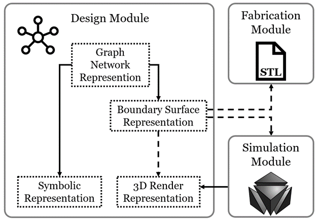
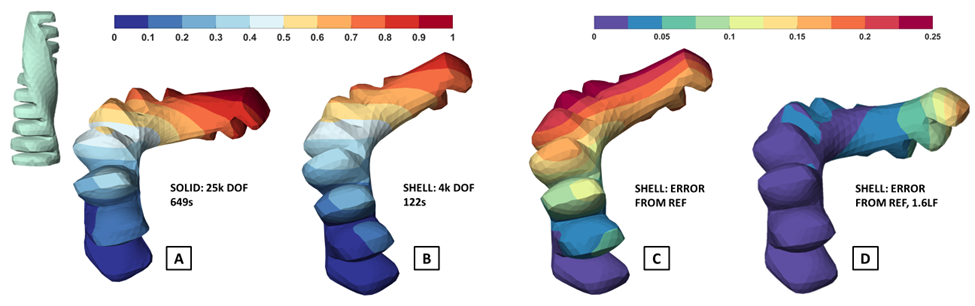
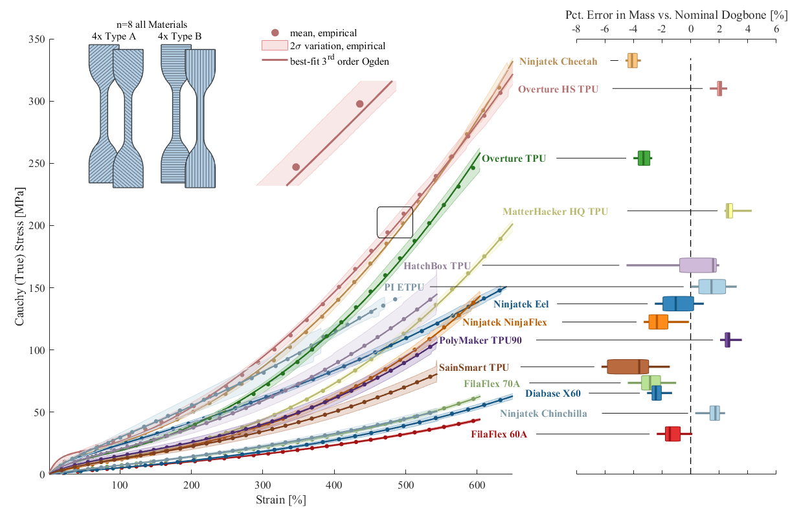
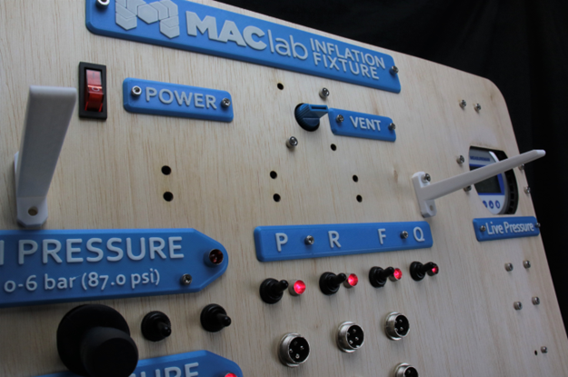

# SOROFORGE

## What is SoRoForge?

SoRoForge is a suite of software tools developed by the Matter Assembly Computation Lab (MACLab) to lower barriers to the design and fabrication of pneumatic soft actuators.

  
*Figure 1. Diagram depicting the seamless flow of data between SoRoForge modules that handle three phases of soft actuator creation: Design, Simulation, and Fabrication.*

---

## Design

Design geometry in SoRoForge is represented by computational graph networks — very different from the feature trees you may be familiar with as an interactive CAD user.

These networks transform input coordinates in 3D space into scalar values that define whether that point is inside, outside, or on the boundary of a design geometry. SoRoForge features an interactive GUI that enables users to edit graph networks — adding, deleting, and inserting nodes, adding connections between existing nodes, changing bias and weight values, and more.

---

## Simulation

Numerical simulation helps predict how a soft robot design behaves without physical fabrication, saving significant time across design iterations.

Typically, soft robots are simulated using computationally expensive 3D finite element (FE) methods that require manual setup and hours to complete. In SoRoForge, designs are simulation-ready by default. With the push of a button, a large-displacement, contact-enabled FE simulation is dispatched to an open-source solver, and results are retrieved and displayed in the GUI when complete.

  
*Figure 2. FE simulation of a soft actuator designed with SoRoForge showing compound twisting and bending behavior in response to internal pressure. A and B display results from simulations using tetrahedral and shell finite elements.*

SoRoForge leverages **shell finite elements** to accelerate simulations, reducing solve time by a factor of 5–10×. For more details, refer to our recent conference paper or demonstration video.

---

## Fabrication

  

Soft robots are often fabricated through casting, gluing, or overmolding — effective methods for mass production but limiting for rapid prototyping and geometric flexibility.  
SoRoForge supports **direct export of fabrication-ready STL files**, the standard format for most 3D printers.

It includes pre-tuned printing profiles enabling fabrication of complex soft actuator geometries capable of bending, grasping, and walking. The system also provides extensive test data for characterizing a wide range of commercially available soft 3D printing filaments.

---

## Characterization

  

SoRoForge aims to accelerate soft robot design and fabrication — but effective design also requires performance evaluation.

To support this, we’ve open-sourced our **Inflation Fixture**, a general-use test device for pneumatic soft robots. It can prescribe pressures and measure flow rates, pressures, electrical resistances, displacements, and forces simultaneously.

Built with **Festo pneumatic components** and **Labjack data acquisition hardware**, this modular fixture balances flexibility, cost-effectiveness, and performance.  
For instance, the setup has been used to gather data on an antagonistic pneumatic bending actuator.

---

## Our Mission

Soft robots offer key advantages over rigid machines — they are inexpensive, robust, and capable of delicate interaction. Whether it’s a robot that can survive falling down stairs, harvest raspberries without bruising them, or handle fragile undersea organisms, **soft robotics offers new possibilities**.

However, design in this domain is inherently multidisciplinary and often inaccessible. Traditional tools built for rigid systems create friction and inefficiency.

**SoRoForge** represents a new paradigm: lowering barriers to entry, unifying design, simulation, and fabrication, and empowering designers and researchers to create the next generation of soft machines — human- and machine-designed alike.
